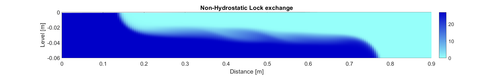
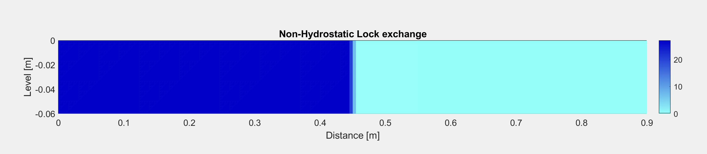
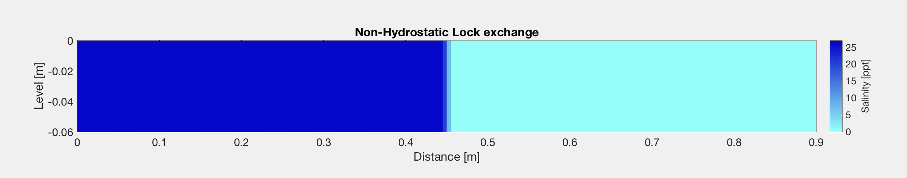

# Lock-Exchange Model and Experiment

This repository contains a SWASH model of a lock-exchange and the corresponding lab experiment.

Due to a combination of sea level rise and deepening of the channels, salt intrusion into Nieuwe Waterweg becomes a real issue, since the freshwater intake is situated somewhat upstream of Botlek harbour. One way to prevent salt (or contaminated water) intrusion into freshwater bodies is by applying the innovative bubble screen method. Recent research by Deltares (https://www.deltares.nl/en/projects/bubble-screen-separates-salt-fresh-water/) has investigated the feasibility of a bubble screen to reduce the salt intrusion during a lock exchange. Air bubbles in combination with fresh water are pumped to form a vertical current which leads to a barrier between the water bodies.

Lab experiments where performed to investigate the propagation of the salt water body front due to the density-driven flow in a simple lock exchange experiment. Unlike a lock exchange process some salt intrusion into the river is allowed except that the salt front is blocked before the freshwater intakes. Since the effectiveness of the bubble screen is thought to also depend on it's location the bubble screen will now be located halfway the freshwater basin to investigate the effectiveness of it. So the experiments where adjusted to assess the applicability of a bubble screen on an open river to block/minimize the salt intrusion.

A numerical model for the reference case of the simple lock exchange (without bubble screen) has been modelled with SWASH in order to understand the propagation mechanisms of salt water fronts. This will aid in the final understanding if and why a specific measure against the salt intrusion will be effective or not. The flow domain of the model has the dimensions that matches the real lock for which the experiments have been carried out (length: 90cm, water depth: 6cm). Since the vertical structure of the velocity and pressure variations is known to be of importance in this kind of flows a non-hydrostatic model has been used in which 240 layers over the vertical have been applied. The flow is initiated through a discrete baroclinic pressure gradient in which the salt water body has a salinity value of 27 ppt (density=1030 kg/m3) and the fresh water body has no salinity concentration at all (density = 1000 kg/m3).

The model is used in order to assess the basic properties of the flow in which it is required that the propagation speed and shape of the salt front are modelled correctly. Other phenomena (e.g. after the front reached the wall it starts to diffuse and mix) are therefore of minor interest. For this reason the k-epsilon model has been taken into account to incorporate the turbulent mixing with the default options. Furthermore, also small values for the horizontal eddy viscosity and diffusivity (10e-6 m2/s) adopted. For the friction also the default option of the Chèzy smoothness parameter has been taken into account to assess possible front deceleration due to the bottom friction. For the numerical approximations of the advection schemes of all the momentum equations the BDF scheme has been adopted including the energy head conservation in the horizontal direction. Since the salinity concentration is a conserved quantity a Flux-limiter (Minmod) has been applied to prevent unreal results (e.g. negative results or larger values w.r.t. beginning concentration).

Since the velocity is expected to be one of the main components which determines if the salt front partially protrudes and/or intrudes a bubble screen the development of the propagation speed of the salt front is of main interest. It can be concluded that the propagation speed of the salt front is almost constant without any significant deceleration and equals the propagation speed of the fresh water front. It is only when the bottom friction is increased (Chèzy value decreased from 65 to 1) that the salt front is slowed down significantly.

This indicates that the propagation of the salt front is almost constant over the time with some significant deceleration only for situations with high friction. So therefore the position of the bubble screen still might be optimized w.r.t. to the propagation speed of the front since already small differences can lead to a more effective blockage of the salt intrusion. Of course other dependencies (e.g. trade-off between propagation distance, turbulent mixing, etc) will also influence the effectiveness of the bubble screen. So therefore it can not be guaranteed that the a location of the bubble screen other than just behind the lock is more effective.
